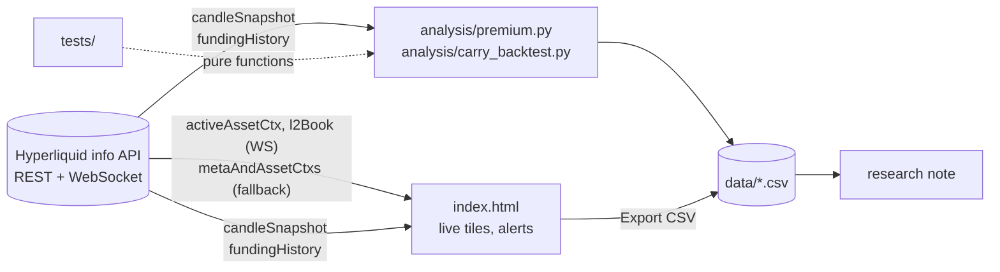

# SKHYNIX / SKHY premium monitor

A small, self-contained toolkit for one question: **why do SK hynix's Nasdaq ADSs trade
about a third above the same shares in Seoul, and how long can that last?**

It has three parts that share one data layer:

| Part | What it is | Where |
|---|---|---|
| Live dashboard | Single HTML file. Streams both Hyperliquid perps over WebSocket, computes mark, oracle and executable premiums, funding carry, session status, history charts, alerts. | [`index.html`](index.html) |
| Analysis scripts | Standard-library Python: premium series, range statistics, unwind arithmetic, and a carry backtest of the compression trade. Unit-tested. | [`analysis/`](analysis), [`tests/`](tests) |
| Research note | Why restricted-conversion depositary receipts carry premiums, what ended TSMC's and Infosys's, and what would end this one. Sources graded by quality. | [`research/skhy-adr-premium.html`](research/skhy-adr-premium.html) |

## The markets

| UI ticker | API coin | Underlying |
|---|---|---|
| SKHYNIX | `xyz:SKHX` | One SK hynix common share (KRX 000660), in USD via the deployer's KRW oracle |
| SKHY | `xyz:SKHY` | One SK hynix ADS (Nasdaq: SKHY), in USD |

Both are HIP-3 perpetuals on Hyperliquid's XYZ dex. Each ADS represents one-tenth of a
share, so everything compares **SKHY × 10** with **SKHYNIX**:

```
premium      = (SKHY × 10) / SKHYNIX − 1
unwind move  = (1 + p_target) / (1 + p_now) − 1        # 36% → 0% is −26.5%, not −36%
carry (1h)   = funding(SKHY) − funding(SKHYNIX)          # long SKHYNIX / short SKHY
```

## Quick start

Open [`index.html`](index.html) in a browser. No server, build step or dependencies; the
page talks to `api.hyperliquid.xyz` directly (the API sends `Access-Control-Allow-Origin: *`).

```bash
python -m unittest discover -s tests -v                 # 11 offline tests
HL_LIVE=1 python -m unittest tests.test_premium.LiveSmoke  # checks both markets exist and the ratio is sane
python analysis/premium.py --interval 1d --csv data/premium_daily.csv
python analysis/carry_backtest.py --start 2026-07-15 --csv data/carry_backtest.csv
```

Python 3.10+; nothing to install.

## How it fits together



The dashboard keeps its own copy of the premium math in JavaScript; the Python module is
the tested reference. Both compute from candle closes so the two agree to the print.

## What the dashboard shows

- **Hero**: live mark premium, change vs 24h ago and vs the 30-day mean, unwind-to-parity move, 24h sparkline. The tab title carries the premium.
- **Tiles**: oracle premium with "oracle last moved" ages (stale oracles are the norm outside KRX or Nasdaq hours), executable premium from the top of both books, funding carry in %/h and APR, implied Seoul price in won, KRX and Nasdaq session countdowns.
- **Charts** (24H / 7D / 30D / All): premium history with min, max, mean, standard deviation, percentile and z-score for the window; both legs on one axis; annualised funding for both. Crosshair tooltips, keyboard navigation, table views, CSV export.
- **Market details**: mark, oracle, mid, bid/ask, spread, basis, funding, open interest, volume, 24h change.
- **Alerts**: upper/lower thresholds and a |z| ≥ 2 regime alert, edge-triggered with hysteresis, browser notification and sound, persisted in local storage, drawn on the chart.

## Findings so far (6 Sep 2026)

| | |
|---|---|
| Premium at listing (9 Jul) | about +7% close, priced 5.8% *below* Seoul |
| Premium now | +37% |
| Range since 15 Jul | +24% to +42%, mean +34%, sd 4 pp |
| Correlation of daily premium change with Seoul move | −0.10 (the premium is set on the US side) |
| ADS float | 177.9M ADSs = 2.44% of the company; conversion quota exhausted at listing |
| Compression trade, 15 Jul → 6 Sep (long 1 SKHYNIX / short 10 SKHY) | price P&L ≈ 0, funding −6% APR, max drawdown 22% of notional |

The last row is the reason the tool exists. On any given day the carry tile can show
+250% APR for the compression trade; over seven weeks the funding netted out negative and
the position spent most of its life under water. The premium is a scarce-security price,
not a mispricing with a timer on it. The research note works through the history.

## Design decisions

Short version; the reasoning is in [`docs/decisions.md`](docs/decisions.md).

- One HTML file, no build: it can be copied to a desk machine and opened. The cost is no module system for the JavaScript, so the math that matters lives in tested Python as well.
- WebSocket first, REST polling as fallback, reconnect with backoff, stale-feed detection after 20 s.
- Three premiums, not one: mark (what trades 24/7), oracle (what the underlyings last printed), executable (what the top of book would fill). They answer different questions and diverge outside exchange hours.
- Data anomalies are flagged, not filtered: the 13 Jul Seoul oracle print is left in the series and annotated.
- Chart palette validated for colour-vision deficiency; every chart has a table twin.

## Limitations

- Session indicators ignore exchange holidays.
- History comes from perp candle closes, which track the oracles within roughly 0.5% but are not exchange prints.
- No persistence: alert history and tick data live only in the open tab. Export CSV or run the Python scripts for durable data.
- Borrow fees and depositary-level ADS counts are not available from public APIs and are tracked by hand in the research note.

## Roadmap

- Persist the tick stream (SQLite) and alert log; Telegram or email delivery for alerts.
- Model the premium against its drivers: US flow proxies, funding, short interest, Korean retail net buying.
- Extend the same layer to other cross-listed pairs on Hyperliquid (Samsung, Kioxia if listed).

## How this was built

Built in two days with Claude Code as a pair, directed and reviewed by hand. The workflow
that mattered: pin the market mapping from the API and the exchange UI before writing a
line, verify every number that enters the research note against a primary source or mark
it as unverified, test the arithmetic that people get wrong (the unwind, the funding sign),
and look at the rendered result rather than trust the code.

Nothing here is investment advice.
